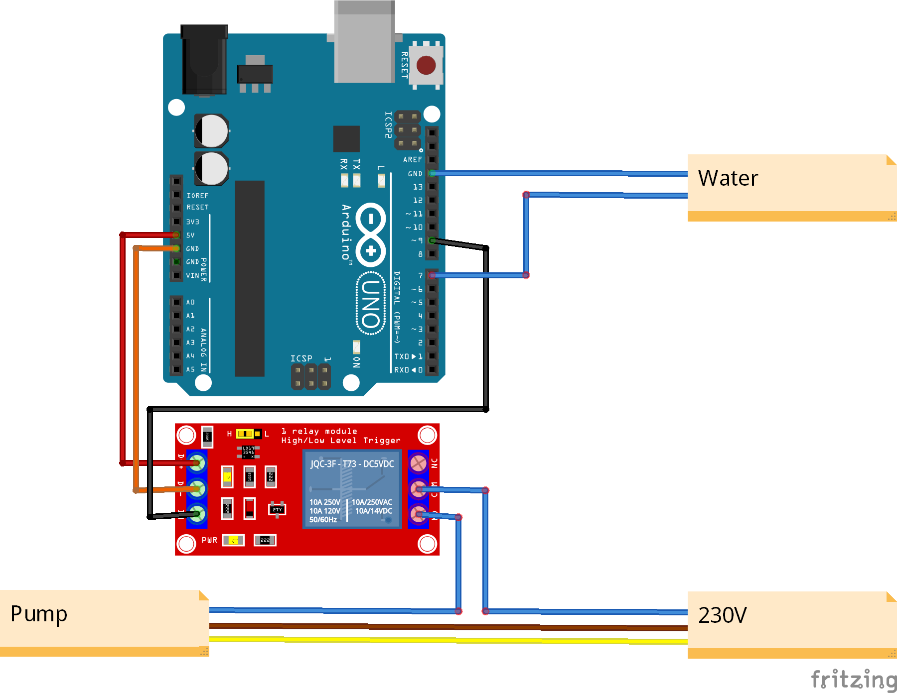

# Name of the project



## About the project

Description of the project **with a picture or video** and sequence of operation.

**Sequence of operation**

1. sequence A
1. sequence B
1. sequence C


## Materials and methods

- Bosch Linear module MKK-040-NN-3
- Bosch Indradrive HCS01.1E-W0003-A-02-B-ET-EC-NN-L4-NN-FW
  - [IndraWorks DS v15](https://www.boschrexroth.com/en/xc/products/product-groups/electric-drives-and-controls/engineering/software-tools/indraworks-engineering) met de offline versie [IndraWorks ML](https://www.boschrexroth.com/en/xc/myrexroth/document-library?p_p_id=20&p_p_lifecycle=0&p_p_state=normal&p_p_mode=view&p_p_col_id=column-1&p_p_col_count=1&_20_struts_action=%2Fdocument_library%2Fview_file_entry&_20_redirect=https%3A%2F%2Fwww.boschrexroth.com%2Fen%2Fweb%2Fxc%2Fmyrexroth%2Fdocument-library%3Fp_p_id%3D20%26p_p_lifecycle%3D0%26p_p_state%3Dnormal%26p_p_mode%3Dview%26p_p_col_id%3Dcolumn-1%26p_p_col_count%3D1%26_20_struts_action%3D%252Fdocument_library%252Fview%26_20_folderId%3D6880008&_20_fileEntryId=6887991&_20_displayed_description=Engineering+software%3B%0AType+code%3A+SWA-IWORKS-ML*-13VRS-D0-DVD**%3B%0ASelf+extracting+installation+program%3B%0AFull+installation+incl.+online+help%3B%0AInstallation+is+subject+to+license+conditions+and+requires+an+activation+key%0A%28alternative+30+day+test+license%29%3B%0A%0ASupported+installation+variants%3A%0AEngineering+MLC+%2F+%0AEngineering+ILC+%2F+%0AOperation+ILC%2C+MLC+%2F+%0ACommunication+ILC%2C+MLC+%2F+%0AWinStudio+Runtime+%2F+%0AMLD+Engineering+%2B+Technology+Functions+%2F+%0ATeamserver+ILC%2C+MLC)
- Bosch SUP-E02-MSM-BATTERY
- Beckhoff 6920
  - [TwinCAT 3](https://www.beckhoff.com/en-us/products/automation/twincat/te1xxx-twincat-3-engineering/te1000.html)
  - TF6820 controller (library)
- PSoC6 Wifi/BT pioneer kit with the BMI-160
  - [ModusToolBox](https://www.cypress.com/products/modustoolbox)
  - Hardware Abstraction Layer (library)


## Results

We use the **Bosch IndraDrive CS** as a drive to regulate the motor. The drive has its own software for configurations, setup and control. The drive will take the commands from the PLC and drive the motor. [More info...](SolutionBosch)

**A case** has been made with the idea of placing the setup in it so that it could be used for transporting as well as for presenting the setup. [More info here](SolutionCase)

**The Beckhoff PLC** will drive the servomotor and get a postion feedback from the gyroscope and accelerometer. This is a closed loop system and to program this in TwinCAT3 we have to use motion control. [More info...](SolutionTwincat)

The Psoc 6 programme retreives the motion data and send it to the Beckoff PLC. We use an external battery the make the psoc 6 wireless. [More info...](SolutionMCU)

- More info can be found under:
  - [Docs](./docs)
  - [Beckhoff website](www.beckhoff.com)


> ### Special notice !
> before applying power to the device ensure there are no obstructions to the linear drive

## Getting started

Nothing as frustrating if you find a nice repo and nice code but have no idea how to get this thing started

- [ ] Place a step-by-step plan (an how-to) here. 
- [ ] Explain how to run the program
- [ ] use step-by-step bullets if needed
- [ ] place remarks such as #defines which needs to be uncommented if some special (hardware-)case is being used.

```c
//#define AREA_CIR

...
    
#if !defined(AREA_CIR)
    bSwitch = TRUE;
	nCount = 50;
#endif
````

If the project consist of different component, references can be made to the different folder of each component which contains a more detailed getting started e.g. [see the TwinCAT Solution](./TwinCAT).


## Future work and issues

An example for Future work is the connectivity between the PLC and Indradrive, the PLC can get data from a phone but still needs to controll the linear slider by sending commands to the Indradrive. An other example is that the PLC gets the orientation and angle acceleration values from the phone using the [App](https://github.com/PXLDigital/2EAI-POZ-PEN-2122-Pendulum/tree/main/SolutionBosch/APP), but the app still has a [problem](https://github.com/PXLDigital/2EAI-POZ-PEN-2122-Pendulum/tree/main/SolutionBosch/APP#polariteit-angle-probleem) and this needs to be fixed. The parameters on twinCAT for the IndraDrive need to be researched.  

Another future project is to control the Indradrive with a phone without the use of a PLC. [more info here](https://github.com/PXLDigital/2EAI-POZ-PEN-2122-Pendulum/blob/main/SolutionBosch/PhoneNoPLC.md)

A PSOC 6 can also be used to replace the phone app.

An issue in the future is the homing on the base of current limitation. There is an option for this called Positive stop.


## Contributing

Contributions are what make the open source community such an amazing place to learn, inspire, and create. Any contributions you make are greatly appreciated. 

Check out our [contributing page](.github/contributing.md) for how to add issues, features and make pull requests.

## People

- **CONTRI BUTOR1** - _CONTRIBUTOR_ - [CONTRI BUTOR1](https://github.com/CONTRIBUTOR1)
- **Dieter Vanrykel** - _TEACHER_ - [Dieter Vanrykel](https://github.com/Vanrykel)
